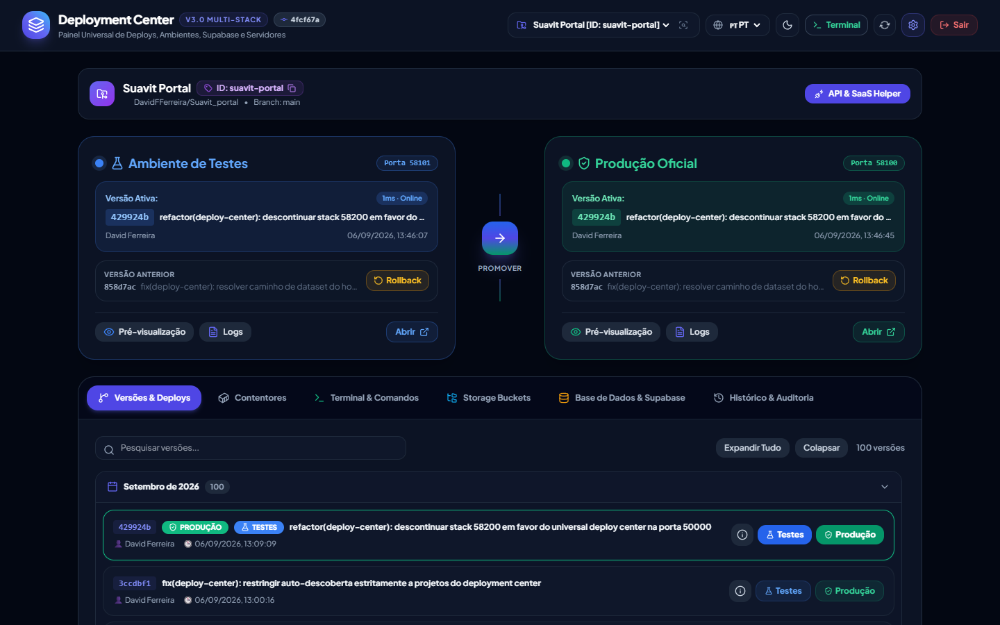
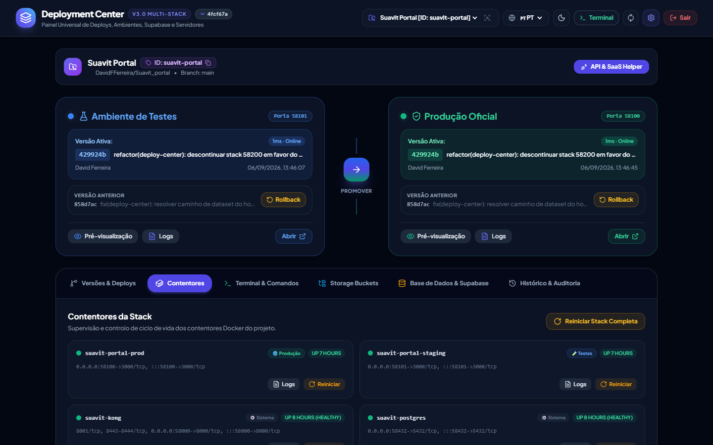
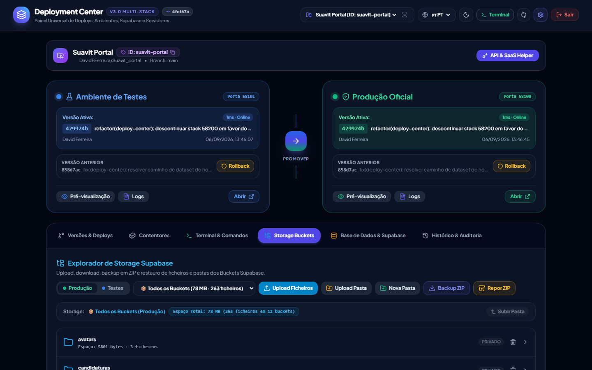
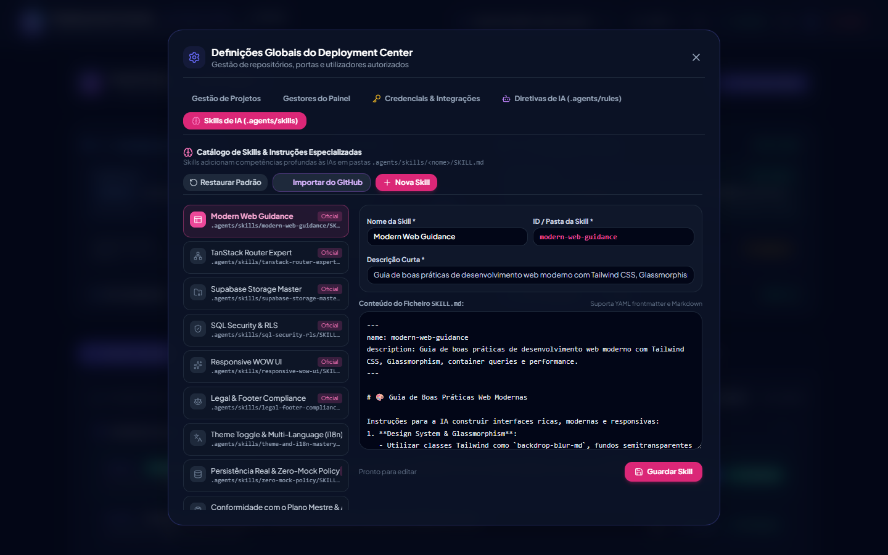
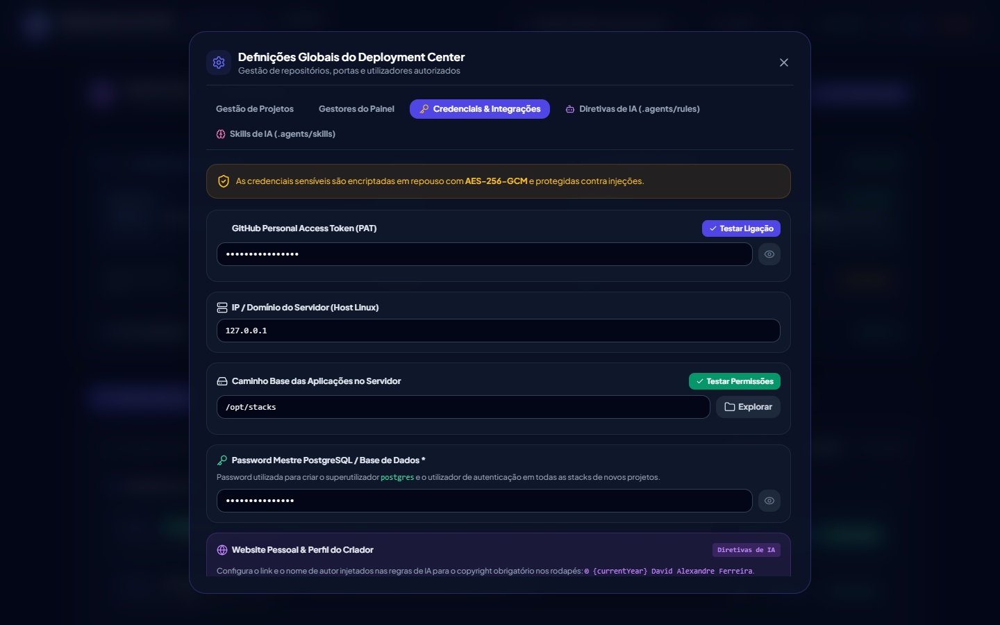

<div align="center">

# 🚀 Universal Deployment Center
### Painel Centralizado de Orquestração Docker, Dual-Stack (Produção & Staging), Supabase On-Premise, Base de Dados, Storage e Governança de Agentes de IA para TrueNAS Scale

[](https://nodejs.org/)
[](https://docs.docker.com/compose/)
[](https://www.postgresql.org/)
[](https://supabase.com/)
[](https://konghq.com/)
[](https://www.truenas.com/)
[](LICENSE)

<br/>

<p align="center">
  <b>O ecossistema definitivo para hospedar, orquestrar, manter e governar stacks completas de aplicações modernas com Supabase local e agentes de Inteligência Artificial no TrueNAS Scale.</b>
</p>

[Visão Geral](#-visão-geral) •
[Funcionalidades](#-todas-as-funcionalidades-com-capturas-de-ecrã) •
[Arquitetura de Contentores (16 por Stack)](#-arquitetura-de-contentores-que-contentores-cria-e-para-que-servem) •
[Governança de IA (Skills & Regras)](#-governança-de-ia-como-funcionam-as-skills-e-as-regras) •
[Guia Passo a Passo (How To)](#-guia-passo-a-passo-how-to) •
[Mapeamento de Portas](#-esquema-de-portas-e-isolamento) •
[Segurança & Vault](#-segurança--vault-de-credenciais)

---

</div>

## 🌐 Visão Geral

O **Universal Deployment Center (v3.0)** é uma plataforma unificada de DevOps on-premise desenvolvida sob medida para servidores **TrueNAS Scale** e ambientes **Linux**. Ele transforma o seu servidor doméstico ou corporativo numa verdadeira infraestrutura *PaaS (Platform as a Service)* semelhante a um Supabase Cloud + Vercel privado e auto-hospedado.

Com um único clique ou comando, o Deployment Center gera ecossistemas isolados **Dual-Stack (Produção Oficial e Ambiente de Testes/Staging)**, equipados com persistência relacional PostgreSQL, API REST PostgREST automática, Autenticação GoTrue com JWT, Storage de ficheiros com suporte S3/MinIO, painel Supabase Studio e roteamento unificado Kong API Gateway.

Além disso, introduz uma camada inédita de **Governança de Agentes de IA**, permitindo injetar dinamicamente diretivas arquiteturais (`.agents/rules/`) e bibliotecas de conhecimento técnico especializado (`.agents/skills/`) diretamente nos repositórios GitHub, garantindo que programadores e IAs (Cursor, Lovable, Claude Code, Antigravity) cumpram normas rigorosas de código, segurança RLS, zero-mock e conformidade jurídica.

---

## 📸 Todas as Funcionalidades (com Capturas de Ecrã)

Todas as funcionalidades descritas abaixo foram capturadas diretamente da interface gráfica em execução do próprio Deployment Center.

---

### 1. 🛡️ Autenticação Segura & Ecrã de Login
<p align="center">
  
</p>

* **Segurança Criptográfica**: Autenticação com proteção HMAC SHA-256 e cookies `HttpOnly` com validade alargada.
* **Múltiplos Níveis de Acesso**: Suporte a utilizadores locais em JSON com hash seguro (`pgcrypto`/`bcrypt`) e auditoria de último acesso.
* **Proteção contra Brute Force**: Limitação de tentativas e mitigação de injeção SQL nos formulários de autenticação.
* **Interface Responsiva**: Design moderno em tons escuros (*dark glassmorphism*) otimizado para desktop, tablets e smartphones.

---

### 2. 🚀 Gestão de Versões, Commits Git & Deploys Dual-Stack
<p align="center">
  
</p>

* **Painel Dual-Stack em Tempo Real**: Monitorização lado a lado da **Versão Ativa de Produção** e da **Versão Ativa de Testes (Staging)** com indicação de porta, commit SHA, autor, data e mensagem.
* **Histórico de Commits Sincronizado**: Integração nativa com a API do GitHub com cache inteligente para listar commits com SHAs curtos, mensagens e autor.
* **Deploy Independente em 1 Clique**:
  * Botão **Testes**: Efetua o build e deploy instantâneo do commit selecionado no ambiente de Staging.
  * Botão **Produção**: Atualiza o ambiente oficial de produção.
* **Promoção Assistida (Staging ➔ Produção)**: Botão de promoção direta com modal de confirmação para levar a versão validada em testes para produção sem refazer builds.
* **Rollback Instantâneo**: Botão de reversão imediata para a versão anterior guardada em caso de anomalias detetadas.
* **Inspeção de Diffs & Commits**: Modal de detalhes para inspecionar os ficheiros modificados e o hash completo antes de aprovar o deploy.
* **Pré-visualização e Links Rápidos**: Botões diretos para aceder aos portais web ativos ou inspecionar os seus logs em tempo real.

---

### 3. 🐳 Orquestrador de Contentores Docker (16 Contentores por Stack)
<p align="center">
  
</p>

* **Supervisão Holística dos Contentores**: Monitoriza todos os contentores em execução criados pelo projeto, agrupados por ambiente (Produção e Staging).
* **Métricas de Recursos em Tempo Real**: Leitura do estado de saúde (*Healthy* / *Running* / *Exited*), mapeamento exato de portas no host e tempo de uptime.
* **Ações Rápidas por Contentor**:
  * **Reiniciar**: Reinicia um contentor individual (ex: apenas o PostgREST ou apenas a API de Auth).
  * **Logs**: Abre uma gaveta flutuante com o streaming dos últimos registos do contentor para diagnóstico veloz.
* **Botão Reiniciar Stack Completa**: Executa uma reinicialização sequencial ordenada de todos os contentores da stack para recuperar dependências de rede sem interrupções manuais.
* **Auto-Reparação de Stack**: Mecanismo que verifica a presença do socket Docker e recria redes ou dependências ausentes automaticamente.

---

### 4. 💻 Terminal Remoto Bash & Ferramentas de Manutenção TrueNAS
<p align="center">
  
</p>

* **Shell Bash Integrado**: Consola web no navegador que executa comandos diretamente no host TrueNAS Scale ou dentro do contentor do Deployment Center.
* **Streaming de Saída**: Visualização em tempo real de fluxos de saída padrão (*stdout*) e erros (*stderr*).
* **Botões de Ação Rápida**:
  * **Update TrueNAS**: Executa o script oficial `update_truenas.sh` para descarregar a versão mais recente do Deployment Center do GitHub e reconstruir a aplicação sem perdas de dados.
  * **Git Pull & Reset**: Força a sincronização do branch `main` com o token do repositório.
  * **Restart Stack**: Reinicia todos os contentores de forma segura.
  * **Docker Prune**: Limpa imagens suspensas, contentores parados e volumes órfãos para poupar espaço em disco no TrueNAS.
  * **Docker Stats**: Apresenta a tabela em tempo real com o consumo de CPU, RAM e I/O de rede de cada contentor.
* **Histórico de Comandos & Cópia**: Navegação com teclas de seta (histórico bash) e botões para limpar consola ou copiar saídas para a área de transferência.

---

### 5. 🗄️ Gestor de Armazenamento Supabase Storage (MinIO / S3)
<p align="center">
  
</p>

* **Explorador Visual de Ficheiros**: Interface tipo gestor de ficheiros moderno para navegar por buckets, pastas e subdiretórios em árvore.
* **Gestão de Buckets Públicos e Privados**:
  * Criação, inspeção e remoção de buckets.
  * Badges visuais claras identificando se o bucket é **PÚBLICO** (acessível via URL direta sem token) ou **PRIVADO** (requer assinatura JWT/service_role).
  * Contagem instantânea de ficheiros e cálculo do espaço total ocupado (MB/GB).
* **Upload e Download em Lote**: Suporte a arrastar e largar (*drag & drop*), upload de pastas completas e validação de MIME type.
* **Backup & Restauro em ZIP**:
  * **Backup ZIP**: Exporta o conteúdo completo de um bucket ou subpasta diretamente num ficheiro ZIP comprimido.
  * **Repor ZIP**: Descomprime e restaura um ficheiro ZIP diretamente no bucket mantendo a hierarquia original.
* **Eliminação Segura**: Confirmação visual para prevenir exclusão acidental de ficheiros críticos de clientes ou anexos de faturação.

---

### 6. 🐘 Gestor de Base de Dados PostgreSQL, RLS & Backups
<p align="center">
  
</p>

* **Métricas Principais da Base de Dados**:
  * Tamanho físico da base de dados PostgreSQL no disco.
  * Contagem total de tabelas criadas no schema `public`.
  * Quantidade total de objetos de storage registados e tamanho agregado.
  * Versão exata do motor PostgreSQL ativo.
* **Links Diretos ao Supabase Studio & Kong**: Acesso com 1 clique ao painel nativo do Supabase Studio (portas `5X323` / `5X324`) e documentação da API Kong.
* **Tabela de Auditoria de Segurança RLS (Row Level Security)**:
  * Lista todas as tabelas com indicação clara do número de linhas e espaço consumido.
  * **Toggle Ativar/Desativar RLS**: Permite ligar ou desligar Row Level Security diretamente pela interface gráfica com feedback em tempo real.
* **Sistema de Backups Instantâneos (Snapshots SQL)**:
  * **Backup Completo (.sql.gz)**: Cria um dump gzip completo da base de dados (schemas `public`, `auth`, `storage` e permissões).
  * **Apenas Schema**: Exporta unicamente o DDL estrutural sem dados para facilitar migrações.
  * **Download Direto**: Descarrega os ficheiros de backup para o seu computador com um clique.
  * **Restaurar SQL Assistido**: Permite selecionar um backup histórico ou fazer upload de um ficheiro `.sql` ou `.sql.gz` para aplicar no banco de Produção ou Staging.

---

### 7. 📜 Histórico de Deploys & Auditoria de Operações
<p align="center">
  
</p>

* **Trilha de Auditoria Imutável**: Registo cronológico de todas as operações efetuadas na plataforma (deploys para staging, deploys para produção, reinicialização de contentores, backups de bases de dados e alterações de RLS).
* **Identificação do Operador**: Grava o nome e username do utilizador que desencadeou a ação.
* **Detalhes do Commit**: Apresenta o SHA curto, mensagem descritiva e carimbo temporal exato de cada evento.

---

### 8. 🪄 Wizard de Provisionamento Automático de Projetos (Stack Generator)
<p align="center">
  
</p>

* **Processo Guiado em 4 Passos**:
  1. **Identificação**: Nome do projeto, slug único (apenas minúsculas e hífen) e opção de criar repositório privado no GitHub automaticamente com o token configurado.
  2. **Portas (Gama 50XXX)**: Atribuição de um prefixo de 2 dígitos (de 10 a 99). O sistema verifica dinamicamente se as 8 portas resultantes já estão em uso por outros contentores no TrueNAS para garantir zero colisões.
  3. **TrueNAS & Armazenamento**: Escolha da pasta de destino em `/mnt/*/apps/` e seleção de ficheiros DDL Canónicos (`.sql`) para executar na inicialização da base de dados.
  4. **Criar Stack**: Provisionamento automático do ficheiro `docker-compose.yml` completo, ficheiros de configuração `kong.yml`, injeção de schemas do Supabase (`auth`, `storage`, roles), inicialização sequencial dos 16 contentores e criação de commit inicial.

---

### 9. 🧠 Gestor de Skills de Inteligência Artificial para Agentes
<p align="center">
  
</p>

* **Biblioteca Centralizada de Conhecimento**: Gestão de pastas de skills padronizadas (`.agents/skills/<skill-id>/SKILL.md`) que ensinam aos modelos de IA (Claude, GPT, Gemini) as convenções exatas da sua empresa.
* **Editor Markdown Integrado**: Crie, edite e formate ficheiros `SKILL.md` com pré-visualização, descrição curta e ícone visual.
* **Importação Direta do GitHub**: Permite colar o URL de qualquer ficheiro `SKILL.md` público ou de repositórios oficiais para importar uma nova competência em segundos.
* **Restaurar Padrão**: Repõe a coleção com as 9 skills oficiais pré-configuradas pela equipa de engenharia.

---

### 10. 📐 Editor de Diretivas & Regras dos Agentes de IA
<p align="center">
  
</p>

* **Diretivas Arquiteturais Estritas**: Regras lidas nativamente por ferramentas de IA (Cursor Rules, Lovable Rules, Claude Code, Antigravity) para impedir más práticas antes de serem escritas em código.
* **Variáveis Dinâmicas com Resolução Automática**:
  * `{name}`: Nome oficial do projeto.
  * `{slug}`: Slug do projeto.
  * `{token}`: Token de autenticação ou chaves Supabase.
  * `{repoOwner}` e `{repoName}`: Repositório no GitHub.
  * `{portProd}` e `{portStaging}`: Portas web atribuídas.
  * `{authorWebsite}`, `{authorName}` e `{currentYear}`: Metadados para copyright e rodapés legais.
* **Sincronização Direta com o Projeto Ativo**: O botão **Sincronizar com Projeto Ativo & GitHub** injeta todas as regras na pasta `.agents/rules/` do projeto no TrueNAS e efetua o commit e push para o repositório GitHub sem intervenção manual.

---

### 11. ⚙️ Definições Globais, Vault de Credenciais & Gestão de Utilizadores
<p align="center">
  
</p>

* **Vault Seguro de Credenciais**: Armazena de forma encriptada o GitHub Personal Access Token (PAT), IP do host TrueNAS Scale e caminhos base de armazenamento.
* **Teste de Ligação em Tempo Real**: Valida a comunicação com a API do GitHub e testa as permissões de leitura/escrita no sistema de ficheiros com feedback visual imediato.
* **Gestão de Utilizadores & RBAC**: Adição e edição de utilizadores com perfis de Administrador, Desenvolvedor e Auditor.
* **Configuração de Metadados de Autoria**: Define o nome do autor e o website para injeção automática nas regras legais portuguesas.

---

## 🏗️ Arquitetura de Contentores: Que Contentores Cria e para que Servem?

Cada projeto gerado pelo Deployment Center através do seu Wizard utiliza uma arquitetura **Dual-Stack completamente isolada**. Para cada projeto são criados **16 contentores Docker** (8 dedicados ao ambiente de **Produção** e 8 dedicados ao ambiente de **Testes / Staging**), garantindo independência absoluta entre a validação de novas funcionalidades e a operação crítica de negócio.

### Tabela Exaustiva dos 16 Contentores por Projeto

Supondo um projeto com o slug `suavit` e o prefixo de porta `58`:

| # | Nome do Contentor | Ambiente | Imagem Docker Oficial | Porta Host (Exemplo) | Função & Para que Serve |
|---|-------------------|----------|------------------------|----------------------|-------------------------|
| **1** | `suavit-postgres-prod` | Produção | `supabase/postgres:15.1.0` | `58432:5432` | **Motor Relacional de Produção**: Base de dados PostgreSQL com extensões `uuid-ossp`, `pgcrypto`, schemas `auth`, `storage`, `public` e utilizadores Supabase configurados. |
| **2** | `suavit-postgres-staging` | Testes | `supabase/postgres:15.1.0` | `58433:5432` | **Motor Relacional de Testes**: Réplica isolada do PostgreSQL para efetuar testes de migração DDL, inserção de dados e validações sem tocar nos dados dos clientes reais. |
| **3** | `suavit-postgrest-prod` | Produção | `postgrest/postgrest:v11.2` | Interna (3000) | **Motor REST API de Produção**: Transforma automaticamente todo o esquema relacional do PostgreSQL de produção numa API RESTful rápida e segura respeitando as regras RLS. |
| **4** | `suavit-postgrest-staging` | Testes | `postgrest/postgrest:v11.2` | Interna (3000) | **Motor REST API de Testes**: Fornece os endpoints REST para o ambiente de testes e validações de pré-produção. |
| **5** | `suavit-auth-prod` | Produção | `supabase/gotrue:v2.132` | Interna (9999) | **Serviço GoTrue Auth Produção**: Emite tokens JWT, gere sessões de utilizadores, recuperação de palavras-passe e login por email/password ou OAuth. |
| **6** | `suavit-auth-staging` | Testes | `supabase/gotrue:v2.132` | Interna (9999) | **Serviço GoTrue Auth Testes**: Servidor de autenticação independente para validar novos fluxos de registo e permissões em ambiente de testes. |
| **7** | `suavit-storage-prod` | Produção | `supabase/storage-api:v0.43`| Interna (5000) | **API de Armazenamento de Produção**: Gere o upload, download, chunks e restrições de MIME types para ficheiros e buckets (faturas, comprovativos, avatares). |
| **8** | `suavit-storage-staging` | Testes | `supabase/storage-api:v0.43`| Interna (5000) | **API de Armazenamento de Testes**: Permite testar uploads pesados e fluxos de ficheiros sem poluir o bucket de produção. |
| **9** | `suavit-meta-prod` | Produção | `supabase/postgres-meta:v0.68`| Interna (8080) | **Introspeção de Esquema Produção**: API interna que inspeciona tabelas, colunas, chaves primárias e relacionamentos do banco de produção. |
| **10**| `suavit-meta-staging` | Testes | `supabase/postgres-meta:v0.68`| Interna (8080) | **Introspeção de Esquema Testes**: Fornece metadados do esquema do banco de testes ao Supabase Studio de Staging. |
| **11**| `suavit-kong-prod` | Produção | `kong:2.8.1-alpine` | `58000:8000` | **API Gateway Unificado de Produção**: Roteia chamadas externas do frontend para o serviço correto: `/auth/v1` ➔ GoTrue, `/rest/v1` ➔ PostgREST, `/storage/v1` ➔ Storage API. |
| **12**| `suavit-kong-staging` | Testes | `kong:2.8.1-alpine` | `58002:8000` | **API Gateway Unificado de Testes**: Roteador API isolado para as rotas do ambiente de testes. |
| **13**| `suavit-studio-prod` | Produção | `supabase/studio:latest` | `58323:3000` | **Dashboard Supabase Studio Produção**: Painel gráfico web para o administrador gerir tabelas, executar SQL no SQL Editor, gerir utilizadores e políticas RLS em produção. |
| **14**| `suavit-studio-staging` | Testes | `supabase/studio:latest` | `58324:3000` | **Dashboard Supabase Studio Testes**: Painel gráfico web para inspecionar e manipular o banco de dados de testes. |
| **15**| `suavit-portal-prod` | Produção | *Imagem do Projeto (React/Vite)* | `58100:80` | **Aplicação Web Oficial de Produção**: O frontend principal servido aos utilizadores e clientes finais. |
| **16**| `suavit-portal-staging` | Testes | *Imagem do Projeto (React/Vite)* | `58101:80` | **Aplicação Web de Testes (Staging)**: A aplicação acessível para a equipa interna testar novas funcionalidades antes de promover a produção. |

### E o Contentor do Próprio Deployment Center?

Adicionalmente, existe o contentor mestre da plataforma:
* **`universal-deploy-center`**: Executa o servidor Node.js/Express na porta **`50000`**. Possui montagem direta do socket do Docker (`/var/run/docker.sock`), permitindo-lhe criar, inspecionar, reiniciar e orquestrar todos os outros contentores do servidor TrueNAS Scale.

---

## 🧠 Governança de IA: Como Funcionam as Skills e as Regras?

No desenvolvimento contemporâneo, ferramentas assistidas por IA como **Cursor**, **Lovable**, **Claude Code** ou **Antigravity** aceleram drasticamente a escrita de código. No entanto, sem regras estritas, estas IAs frequentemente:
* Utilizam dados falsos (*mocks*) em vez de persistirem no banco de dados.
* Omitem cláusulas de segurança RLS no PostgreSQL.
* Quebram rotas tipadas do TanStack Router através de `as any`.
* Esquecem termos de privacidade, políticas de cookies e conformidade RGPD/CNPD para Portugal.

O Deployment Center resolve este desafio através de um sistema de governança modular de dois níveis:

### 1. As Regras dos Agentes (`.agents/rules/`)
As **Regras** são ficheiros de texto ou markdown estruturados que definem **leis invioláveis de conduta** para o modelo de linguagem durante a sessão de programação.
* **Onde residem**: Na pasta `.agents/rules/` de cada repositório.
* **Como funcionam**: Quando um programador abre o projeto no Cursor ou Lovable, o editor carrega automaticamente estes ficheiros no contexto inicial da IA.
* **Injeção Dinâmica**: O Deployment Center interpola variáveis no momento da criação do projeto ou sincronização:
  * `{name}` ➔ Nome do Projeto
  * `{portProd}` / `{portStaging}` ➔ Portas reais de execução
  * `{authorWebsite}` e `{authorName}` ➔ Dados legais do criador
  * `{currentYear}` ➔ Ano corrente
* **Regras Padrão Incluídas**:
  1. `commit_message`: Força o padrão Conventional Commits (`feat:`, `fix:`, `refactor:`) e a inclusão do comando `curl` para TrueNAS.
  2. `tanstack_routes`: Obriga o uso de `createFileRoute` tipado, `<Outlet />` em ficheiros de layout e proíbe casting cego com `as any`.
  3. `prevencao_erros`: Checklist contra memory leaks, loops em useEffect e timeouts em conexões Supabase.
  4. `lovable_client`: Configura cliente Supabase com auto-reconnect resiliente.
  5. `design_system`: Obriga a paleta Tailwind com Glassmorphism, modais expansíveis e contraste WCAG AAA.
  6. `docker_pinning`: Proíbe tags `:latest` instáveis em contentores de produção.
  7. `zero_mock_policy`: Proíbe estritamente dados simulados ou listas estáticas; todas as tabelas devem ligar ao PostgreSQL.
  8. `master_plan_compliance`: Exige a leitura do plano arquitetural e respeito estrito ao DDL SQL.
  9. `footer_legal_compliance`: Garante o rodapé padronizado com licença e links legais portugueses.
  10. `theme_and_i18n`: Implementa modo Dark/Light e suporte a PT-PT, EN, FR e ES.

### 2. As Skills dos Agentes (`.agents/skills/`)
As **Skills** são diretórios modulares contendo um ficheiro mestre `SKILL.md` com YAML frontmatter, exemplos práticos de implementação e referências aprofundadas.
* **Onde residem**: Na pasta `.agents/skills/<skill-id>/SKILL.md`.
* **Como funcionam**: Enquanto uma regra define o "o que é proibido", uma skill ensina o **"como fazer com excelência"**. A IA consulta a skill quando precisa executar uma tarefa técnica complexa (ex: criar rotas complexas, configurar RLS avançado ou carregar ficheiros em chunks).
* **Skills Padrão Incluídas**:
  * `modern-web-guidance`: Guia de CSS moderno, container queries, Tailwind e otimização Core Web Vitals.
  * `tanstack-router-expert`: Arquitetura completa de navegação com TanStack Router.
  * `supabase-storage-master`: Gestão de upload de ficheiros, MIME types e links assinados.
  * `sql-security-rls`: Escrita de políticas de Row Level Security seguras para PostgreSQL.
  * `responsive-wow-ui`: Padrões para criar interfaces visuais impactantes e modais diagnósticos.
  * `legal-footer-compliance`: Conformidade com legislação de proteção de dados e privacidade em Portugal.
  * `theme-and-i18n-mastery`: Internacionalização e alternância de temas.
  * `zero-mock-policy`: Técnicas de persistência direta contra Supabase/PostgreSQL.
  * `master-plan-compliance`: Metodologia de respeito ao plano de implementação de software.

---

## 📖 Guia Passo a Passo (How To)

### 1. Como Iniciar o Deployment Center no Servidor (TrueNAS Scale / Linux)

#### Pré-requisitos
* Host com Docker e Docker Compose instalados.
* Acesso ao socket Docker local (`/var/run/docker.sock`).
* Acesso de leitura/escrita ao pool de armazenamento (ex: `/mnt/Disco1/apps/`).

#### Arranque com Docker Compose
Clone o repositório e inicie o contentor:
```bash
# 1. Clonar o repositório
git clone https://github.com/DavidFFerreira/Deployment_center.git /mnt/Disco1/apps/deployment-center
cd /mnt/Disco1/apps/deployment-center

# 2. Iniciar a stack na porta 50000
docker compose up -d --build
```

Aceda imediatamente no seu navegador:
```
http://<IP_DO_TRUENAS>:50000/
```

Credenciais padrão de administrador:
* **Username**: `admin`
* **Password**: `suavit_deploy_master_2026!` *(ou o valor definido na variável DEPLOYER_ADMIN_PASSWORD)*

---

### 2. Como Atualizar o Deployment Center com 1 Comando
Para atualizar o Deployment Center para a versão mais recente diretamente a partir do repositório GitHub, execute na consola do servidor ou no próprio **Terminal Integrado do painel**:
```bash
curl -fsSL https://raw.githubusercontent.com/DavidFFerreira/Deployment_center/main/update_truenas.sh | bash
```
O script sincroniza o branch `main` do GitHub e reconstrói o contentor sem perder as configurações do diretório `data/`.

---

### 3. Como Criar um Novo Projeto com o Wizard
1. No cabeçalho, clique no ícone de definições ⚙️ ou abra o botão **Criar Novo Projeto (Wizard)**.
2. Preencha o **Nome do Projeto** (ex: *Suavit Logística*) e verifique o **Slug** gerado (`suavit-logistica`).
3. Marque a opção **Criar Repositório Privado no GitHub Automaticamente** se desejar que o Deployment Center crie o repositório na sua conta.
4. Introduza um **Prefixo de 2 Dígitos** (ex: `57`). O sistema validará se nenhuma porta (`57100`, `57101`, `57000`, `57432`, `57323`) está ocupada.
5. Selecione as **Skills de IA** que pretende injetar no repositório.
6. Carregue os seus ficheiros DDL Canónicos (`.sql`) se já tiver o esquema das tabelas definido.
7. Clique em **Criar Projeto e Iniciar Stack**.
8. O Deployment Center criará a pasta no TrueNAS, gerará o `docker-compose.yml` de 16 contentores, configurará o PostgreSQL, executará o DDL, injetará as regras de IA e iniciará os serviços.

---

### 4. Como Fazer Deploy e Rollback de uma Aplicação
1. Na aba **Versões & Deploys**, selecione o projeto no menu superior.
2. A lista de commits mais recentes do GitHub será exibida.
3. Para testar uma nova versão:
   * Localize o commit desejado e clique no botão azul **Testes**.
   * O Deployment Center atualiza o código no servidor e reconstrói a imagem do ambiente de Staging (porta `XX101`).
4. Abra o site de testes clicando no botão **Abrir** do cartão *Ambiente de Testes*.
5. Após validação, clique no botão roxo central **PROMOVER** para passar a versão para o ambiente de Produção Oficial (porta `XX100`).
6. Se detetar um problema imprevisto:
   * Clique em **Rollback** no cartão de Produção para reverter instantaneamente para o commit anterior estável.

---

### 5. Como Fazer Backup e Restauro da Base de Dados
1. Aceda à aba **Base de Dados & Supabase**.
2. Clique no botão verde **Backup Completo (.sql.gz)**.
3. Um snapshot comprimido será gerado imediatamente na pasta `data/backups/`.
4. Pode descarregar o ficheiro para o seu computador clicando no botão **Descarregar**.
5. Para restaurar um estado anterior:
   * Clique em **Restaurar (production)** ao lado do backup pretendido ou utilize o botão **Restaurar SQL** para enviar um ficheiro do seu computador.
   * O sistema restaura o esquema e os dados de forma assistida.

---

### 6. Como Sincronizar Regras de IA com Repositórios Existentes
1. Aceda às **Definições Globais** (⚙️) ➔ aba **Diretivas de IA (.agents/rules)**.
2. Edite as regras desejadas no editor visual integrado.
3. Clique em **Guardar Esta Regra**.
4. Clique no botão roxo **Sincronizar com Projeto Ativo & GitHub**.
5. O sistema resolve todas as variáveis dinâmicas e faz commit/push automático para o repositório do projeto, atualizando as diretivas de imediato para todos os programadores da equipa.

---

## 🔢 Esquema de Portas e Isolamento

O Deployment Center utiliza a **Gama de Portas 50000 a 59999** para garantir que nenhuma aplicação entre em conflito com os serviços nativos do TrueNAS Scale (como as portas 80, 443, 8080 ou 5432).

### Convenção do Prefixo de 2 Dígitos (`XX` de 10 a 99):

```
Prefixo Base: XX (ex: 58)

Produção Oficial:
├── 58100 ➔ Portal Web de Produção (Frontend)
├── 58000 ➔ Kong API Gateway Produção (REST, Auth, Storage)
├── 58323 ➔ Supabase Studio Dashboard Produção
└── 58432 ➔ PostgreSQL Base de Dados Produção

Ambiente de Testes (Staging):
├── 58101 ➔ Portal Web de Testes (Frontend)
├── 58002 ➔ Kong API Gateway Testes
├── 58324 ➔ Supabase Studio Dashboard Testes
└── 58433 ➔ PostgreSQL Base de Dados Testes
```

O contentor do **Deployment Center** opera isoladamente na porta **`50000`**.

---

## 🔒 Segurança & Vault de Credenciais

* **Encriptação em Repouso**: Tokens GitHub PAT e chaves de acesso são guardados de forma cifrada no volume local de dados.
* **Cookies Seguros**: Sessões web protegidas com assinaturas criptográficas HMAC SHA-256 e flags `HttpOnly`.
* **Isolamento de Redes Docker**: Cada stack de projeto reside na sua própria rede em ponte (*bridge network* isolada), impedindo acessos cruzados não autorizados entre bases de dados de clientes distintos.
* **Zero Risco de Colisão de Portas**: O verificador de portas inspeciona o output em tempo real de `docker ps` antes de permitir a criação de qualquer stack nova.

---

## 🛠️ Tecnologias Utilizadas

* **Runtime**: Node.js 20 LTS (Bookworm Slim)
* **Framework Web**: Express 4 com Cookie-Parser
* **Front-end**: Vanilla Modern JavaScript, Tailwind CSS (CDN), Lucide Icons, Glassmorphism UX
* **Orquestração de Contentores**: Docker Engine 24+ & Docker Compose v2.29+
* **Stack de Backend Integrada**:
  * PostgreSQL 15/16 oficial com PostgREST v11.2
  * GoTrue v2 (Supabase Auth)
  * Supabase Storage API v0.43
  * Supabase Postgres-Meta v0.68
  * Kong Gateway 2.8.1 Alpine
  * Supabase Studio Dashboard
* **Sistemas Operativos Alvo**: TrueNAS Scale (Debian-based), Ubuntu Server 22.04/24.04 LTS, Debian 12

---

<div align="center">

### Desenvolvido com rigor por David Ferreira
© 2026 David Ferreira. Todos os direitos reservados.

[Voltar ao Topo](#-universal-deployment-center)

</div>
